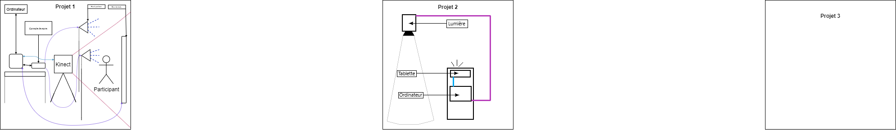

# Preproduction espace interactif

## Intention du concept

### Synopsis

> Trois projets, un espace commun. Un espace interactif mettant de l'avant les différentes compétences acquises des membres de l'équipe. Un espace où le public pourra interagir avec les différents projets.
>  

> Le public est appelé à participer à ces expériences interactives ouvertes à tous!

### Cartographie

### Intention de départ

> En temps qu'équipe ayant trois projets dans espace commun, nous souhaitons faire profiter les participants de trois expériences multimédias démontrant les talents divers acquis par les membres de l'équipe.

### Moodboard

Simulateur de planète 

### Documents

## Contenu multimédia à intégrer

Chaque projet aura son propre contenu multimédia à intégrer. il y aura de la réalité virtuelle, de la capture de mouvement et même un jeu sur tablette. Tout dans le même espace.

Le simulateur de planète va être un jeu unity

### Inventaire du contenu multimédia

### Univers artistique des éléments

- dans le casque vr il ya aura des paysages à voir tout en 360 degré.
- pour la capture de mouvement, il y aura un jeu interactif qui va emmener l'interacteur a bouger sans se faire trop mal.
- l'autre capture de mouvement sera une présentation artistique d'un mur illuminé par les passants
- le jeu sera un divertissement pour chaque interacteur qui passera par la.

## Planification technique d'un prototype

### Plans technique

### Matériaux requis

- Des planches de bois
- Des lumières
- Chaise
- Mur amovible
- Leds

### Équipement requis

#### Audio

- Interface audio USB disposant 8 sorties
- haut-parleurs actifs de 4"

#### Vidéo

- Kinect

#### Électricité

- Des multiprise
- Des extentions
- Des conducteurs
- Recharge pour casque vr
- Fils (Électrique, HDMI et autres)

#### Ordinateur

- Ordinateurs
- Casque vr
- Tablette 

#### Autres

- Leds

### logiciels requis

- [Max](https://cycling74.com/downloads)
- [Kinect studio](https://github.com/Kinect/Docs/blob/master/Kinect4Windows2.0/k4w2/NUI_Tools/Kinect_Studio.md)
- [Unity](https://unity.com/fr)
- [Touch designer](https://derivative.ca/)
- [Blender](https://www.blender.org/) ou Maya
- [OBS Studio](https://obsproject.com/fr)
- [VCV Rack 2](https://vcvrack.com/Rack)

### Ressources humaines requises

- TTP, location des matériaux
- Les membres de l'équipe pour l'installation des projets
- Les participants (le public)

### Ressources spatiales requise

#### Le grand studio

- Un espace assez grand pour contenir nos trois projets
- Un espace pour permettre de mettre des hauts-parleurs

### Contraintes techniques et potentiels problèmes de production
-Avoir des instructions claires pour les participants pour démarrer l'immersion de chaque projet sans l'aide des créateurs du projets.
-3 projets fonctionnels sans avoir besoin de la présence des créateurs des projets
-Avoir une démarcation visible des 3 projets placés dans le grand studio
-Mettre en place une manière simple et efficace de pouvoir garder les équipements nécessaires pour les projets chargés et prêts à l'utilisation.
-Cable des projets qui pourrait être sur le chemin du public

## Planification de la production d'un prototype (budget et étapes de réalisation)

### Budget prévisionnel

- Achat de logiciels manquant au collège
- Tout les matériaux pour constuire l'espace nécessaire et les différents projets
- Une chaise
- Station de recharge pour les casques vr

Simulateur de planète
- Budget de 150$ pour des planches de bois pour le podium pour la tablette.

### échéancier global

### liste des tâches à réaliser

#### Antoine Dion

- Location des matériaux et équipement requis pour le projet.
- Achat si nécessaire de matériaux manquant pour la réalisation du projet.
- Installation de l'équipement dans l'espace physique.
- Tests et calibrage du logiciel OBS Studio.
- Tests et calibrage du logiciel Touch Designer
- Test et calibrage de la Kinect et de son logiciel.
- Création de sons sur VCV Rack 2.
- Tests et calibrages de VCV Rack avec la console audio, l'ordinateur et les hauts-parleurs.
- Tests et calibrages des hauts-parleurs.

#### Érick Ouellette et Nicholas St-Martin

- Achat des matériaux (planches de bois)
- Création des modèles 3d
- Création de sons
- Assemblage du podium pour la tablette
- Programmation sur Unity

### Rôles et responsabilitées des membres de l'équipe

#### Antoine Dion

- Coordination générale du projet (coordination de l'échéancier, du budget, suivi de la liste des tâches à réaliser, s'assurer de la répartition du rôle et des responsabilités des membres de l'équipe).
- Comité Technique et coordination technique (suivi du devis technique).
- Comité auditif et coordination auditif (suivi du devis technique auditif).
- Création des paysages sonores.
- Coordination artistique (pour s'assurer que l'intention/concept artistique du projet initial demeure, sinon consulter les membres de l'équipe par précaution).
- Installation et mise en place de la capture audio-visuelle du projet en temps réel.
- Création du module d'interprétation des données.

#### Érick Ouellette et Nicholas St-Martin
- Création des médias 3d et audio
- Programmation du jeu
- Assemblage du podium
- Configuration de lumière interactive sur le podium

### Moments des rencontres d'équipe

Hebdomadaire
Vendredi 9 février (1h-2h)

Autre
Vendredi 8 mars (1h-2h)
